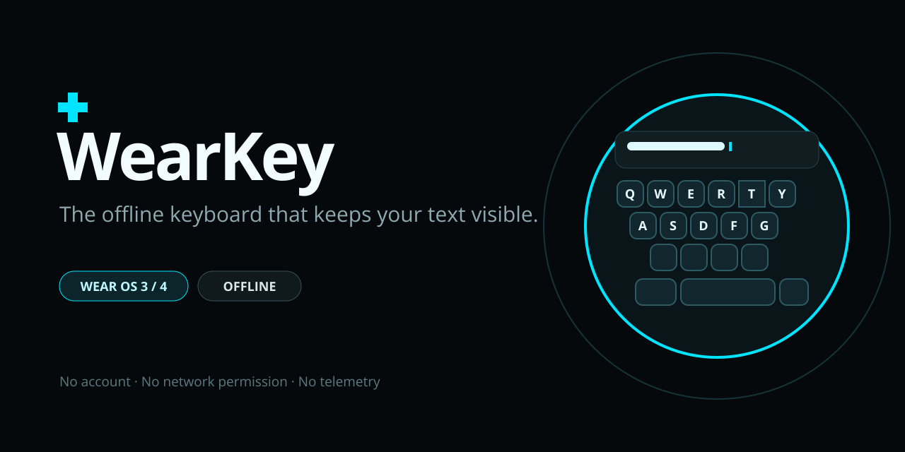

# WearKey

<p align="center">
  
</p>

<p align="center">
  An offline Wear OS keyboard that leaves the text field on screen.
</p>

<p align="center">
  <a href="https://github.com/DarsmaOfficial/Keyboard-for-watch-/actions/workflows/build.yml"></a>
  <a href="LICENSE"></a>
  
  
</p>

## Why I made it

On my OnePlus Watch 2, the stock keyboard often covered the field I was editing. I could type, but
I could not see the result until I closed the keyboard. WearKey fixes that in two ways: it uses only
the lower part of the display, and it keeps a small copy of the current text above the keys.

The project is mainly built and tested for the OnePlus Watch 2. It should run on other Wear OS 3
and 4 watches (`minSdk 30`), but I do not have every model to test.

## What it has

- English and Russian layouts
- tap typing, shift, caps lock and two symbol pages
- a text strip with a movable caret
- offline autocorrect, glide typing and optional spatial prediction
- clipboard history with pin, delete and clear controls
- emoji, themes, haptic settings and touch calibration
- the normal Android IME entry point and Wear OS's `LAUNCH_KEYBOARD` reply entry point

Everything runs on the watch. The app has no Internet or microphone permission, no account,
analytics, ads or companion phone service. Clipboard history is stored in app-private encrypted
storage. Password and PIN fields are represented by bullets in the text strip; their plaintext is
not kept in WearKey's editor buffer.

TalkBack touch exploration is not supported. There are also a few measurements still open, and the
strict cold-process startup target is currently missed. [`STATUS.md`](STATUS.md) has the full test
record, including failed and unverified checks rather than only the good numbers.

## Install

Download the APK and its checksum from [Releases](https://github.com/DarsmaOfficial/Keyboard-for-watch-/releases),
then install it over wireless ADB:

```sh
adb connect <watch-ip>:<port>
adb install -r wearkey-*.apk
adb shell ime enable dev.darsma.wearkey/.WearKeyImeService
adb shell ime set dev.darsma.wearkey/.WearKeyImeService
```

You can also enable it on the watch under **Settings → General → Input → Keyboards**. The two `ime`
commands work through Shizuku as well if you already use it on the watch.

## Build

You need JDK 17, Android SDK platform 36 and build-tools 36.1.0.

```sh
git clone https://github.com/DarsmaOfficial/Keyboard-for-watch-.git
cd Keyboard-for-watch-
./gradlew :app:assembleDebug
```

The APK is written to `app/build/outputs/apk/debug/`. Once the Gradle dependencies have been cached,
the project can be built without a network connection; see [`OFFLINE_BUILD.md`](OFFLINE_BUILD.md).

Run the test suite with:

```sh
./gradlew :ime-core:test :dict:test :layout-engine:test :engine-swipe:test \
  :ui-wear:testDebugUnitTest :app:testDebugUnitTest
```

## Source layout

| Module | Purpose |
|---|---|
| [`:ime-core`](ime-core/) | Editor state, caret handling, touch calibration and clipboard logic |
| [`:dict`](dict/) | Memory-mapped dictionaries and autocorrect |
| [`:engine-swipe`](engine-swipe/) | Glide recognition and spatial word resolution |
| [`:ui-wear`](ui-wear/) | The Canvas/View keyboard, text strip, panels, themes and motion |
| [`:app`](app/) | Android IME service, Wear reply activity, settings and packaged assets |

[`ARCHITECTURE.md`](ARCHITECTURE.md) explains the less obvious decisions, especially the keyboard
height, dictionary format and memory limits.

## Contributing

Pull requests are welcome, but please read [`CONTRIBUTING.md`](CONTRIBUTING.md) first. The short
version: the keyboard stays offline, touch-only, permissively licensed and free of native code or
Compose in the typing path.

## Licence

Apache-2.0. See [`LICENSE`](LICENSE), [`NOTICE`](NOTICE) and
[`THIRD_PARTY_LICENSES.md`](THIRD_PARTY_LICENSES.md).
